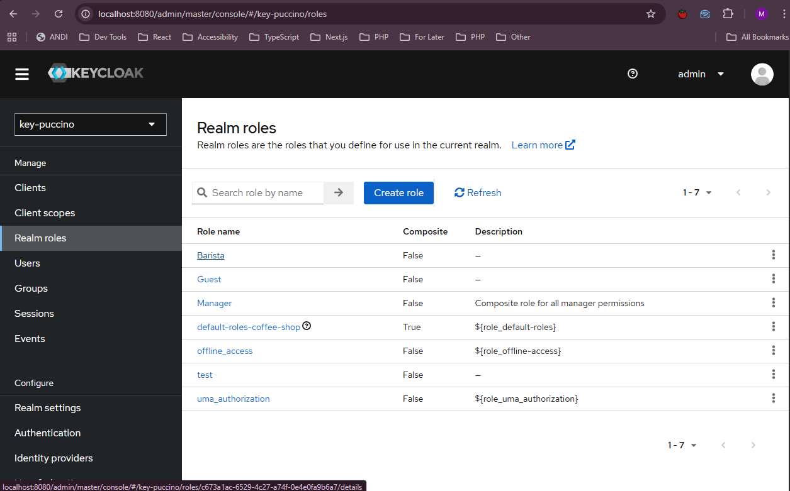
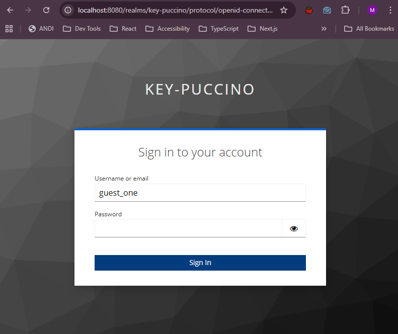
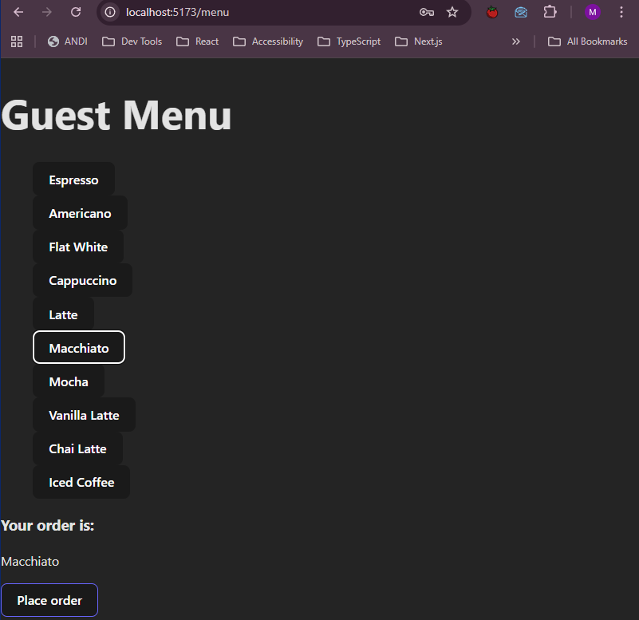
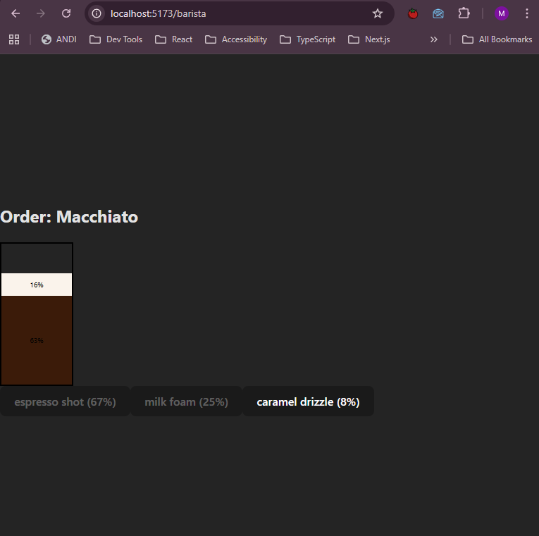
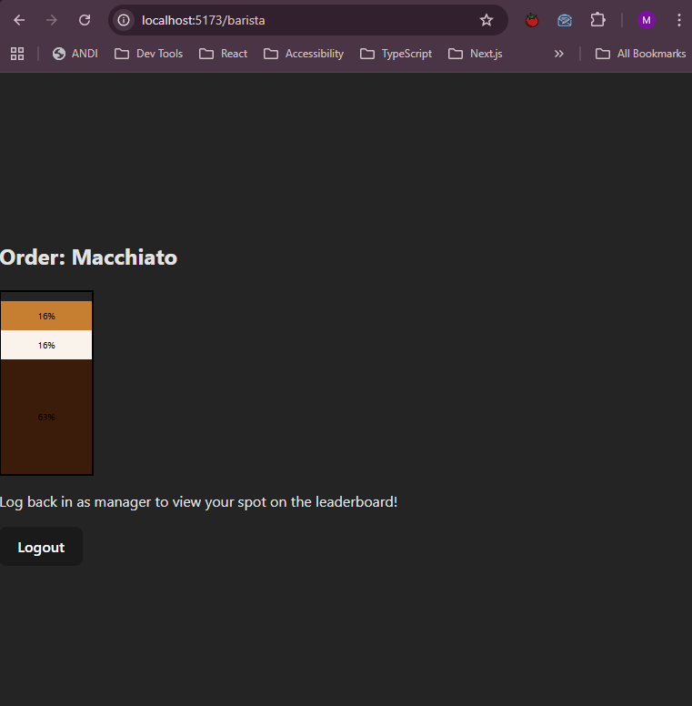
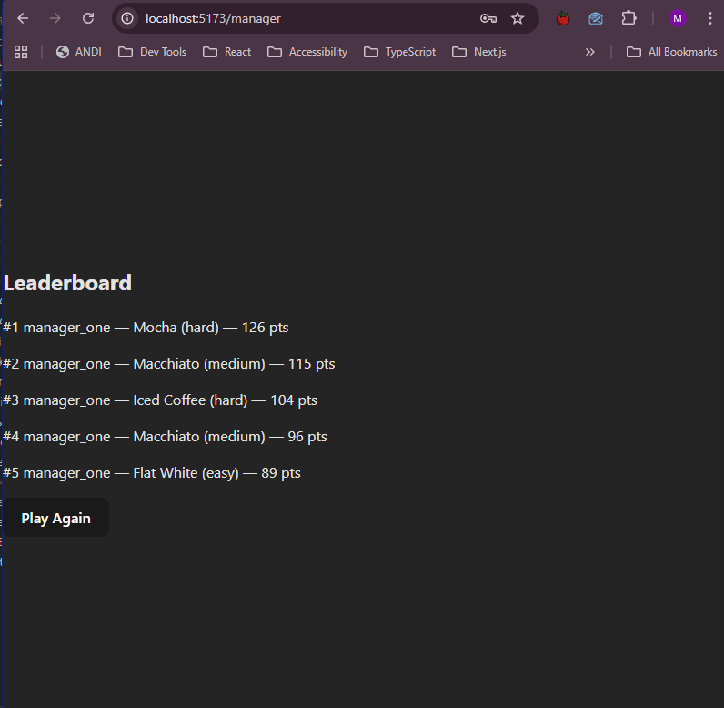
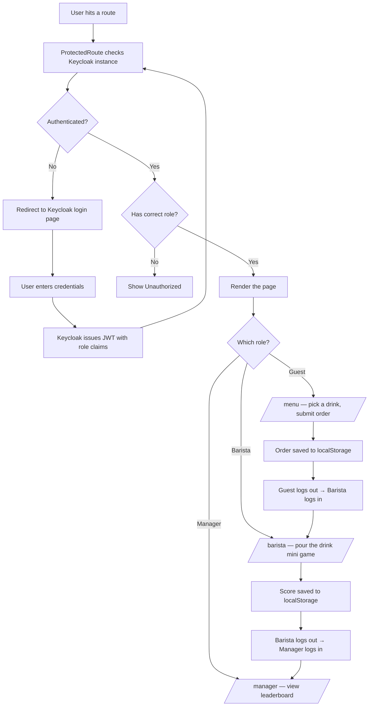

# ☕ Key-Puccino

A role-based auth demo built with React, React Router, Keycloak, and Docker. Simulates a café workflow to show real-world RBAC and route protection in a frontend app.

---

## How it works

The user performs as the guest ordering a drink, the barista making it, and the manager checking quality and accuracy!

```
Guest → picks and submits a drink order
  ↓ logs out, barista logs in
Barista → plays a mini game simulating pouring the drink by ingredient
  ↓ logs out, manager logs in
Manager → sees the scored result on a leaderboard
```

Since there's no backend the order data and scores are saved in `localStorage` in case states get lost during role switching.

---

## Screenshots

[!NOTE]
 ⚠️ No judging the lack of styling here as that moment has not arrived (and it may never)

### Keycloak — Realm roles


### Keycloak login page


### Guest — drink selection


### Barista — mid pour


### Barista — order complete


### Manager — leaderboard


---

## Auth flow



---

## Stack

- React + React Router
- Keycloak (`@react-keycloak/web`)
- Docker

---

## Setup

**1. Start Keycloak with the realm config:**
```bash
docker run -p 8080:8080 \
  -e KEYCLOAK_ADMIN=admin \
  -e KEYCLOAK_ADMIN_PASSWORD=admin \
  -v /path/to/keycloak-export.json:/opt/keycloak/data/import/realm.json \
  quay.io/keycloak/keycloak:24.0.1 start-dev --import-realm
```

**2. Start the React app:**
```bash
cd coffee-shop
npm run dev
```

Then go to `http://localhost:5173/menu` and log in as a guest to start!

---

## Notes

- Leaderboard is localStorage only
- To add more players, create new Keycloak users and assign the appropriate role
- No styling beyond inline AT THIS TIME — this is an auth demo, not a UI demo.

---